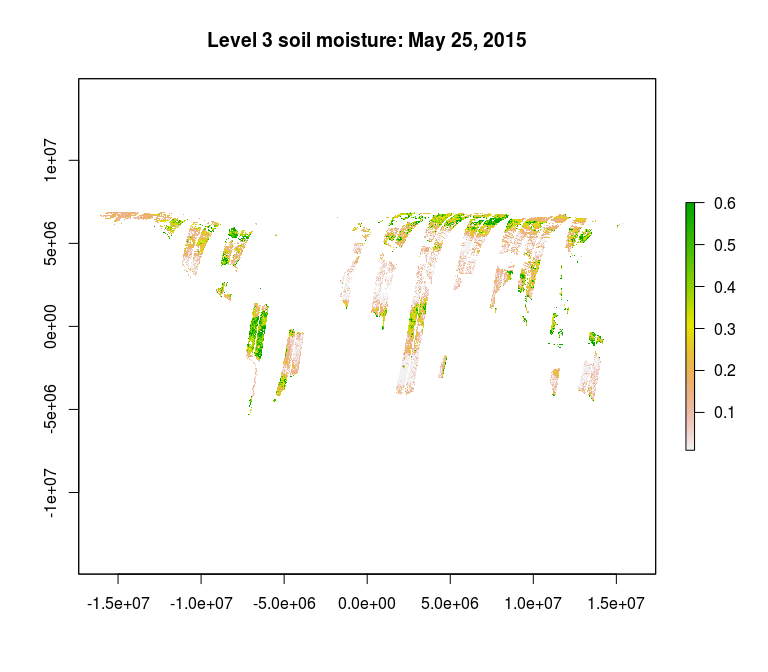

smapr
================

[](https://travis-ci.org/earthlab/smapr) [](https://codecov.io/gh/earthlab/smapr) [](https://cran.r-project.org/package=smapr)

An R package for acquisition and processing of [NASA (Soil Moisture Active-Passive) SMAP data](http://smap.jpl.nasa.gov/)

Installation
------------

### Dependencies

To install smapr, you'll need the following R packages:

-   httr
-   rappdirs
-   raster
-   rgdal
-   rhdf5
-   rvest
-   utils
-   xml2

Note that rhdf5 is a [Bioconductor](http://bioconductor.org/) package, and will not be installed by default when trying to install smapr via `install.packages`. For rhdf5 installation instructions see <http://bioconductor.org/packages/release/bioc/html/rhdf5.html>

To install from CRAN:

``` r
install.packages("smapr")
```

Development version:

``` r
devtools::install_github("earthlab/smapr")
```

Authentication
--------------

Access to the NASA SMAP data requires authentication through NASA's Earthdata portal. If you do not already have a username and password through Earthdata, you can register for an account here: <https://urs.earthdata.nasa.gov/> You cannot use this package without an Earthdata account.

Once you have an account, you need to pass your Earthdata username (`ed_un`) and password (`ed_pw`) as environmental variables that can be read from within your R session. There are a couple of ways to do this:

-   Use `Sys.setenv()` interactively in your R session to set your username and password (not including the `<` and `>`):

``` r
Sys.setenv(ed_un = "<your username>", ed_pw = "<your password>")
```

-   Use `Sys.setenv()` in your `.Rprofile` to set those environmental variables every time you load R.

-   Create a text file `.Renviron` in your home directory, which contains your username and password. If you don't know what your home directory is, execute `normalizePath("~/")` in the R console and it will be printed. Be sure to include a new line at the end of the file or R will fail silently when loading it.

Example `.Renviron file` (note the new line at the end!):

    ed_un=slkdjfsldkjfs
    ed_pw=dlfkjDD124^

Once this file is created, restart your R session and you should now be able to access these environment variables (e.g., via `Sys.getenv(ed_un)`).

SMAP data products
==================

Multiple SMAP data products are provided by the NSIDC, and these products vary in the amount of processing. Currently, smapr supports the more processed level 3 and level 4 data products, which represent global daily composite and global three hourly modeled data products, respectively. NSIDC provides documentation for all SMAP data products on their [website](https://nsidc.org/data/smap/smap-data.html), and we provide a summary of level 3 and level 4 products below.

| Dataset id  | Description                                         | Resolution |
|-------------|-----------------------------------------------------|------------|
| SPL2SMAP\_S | SMAP/Sentinel-1 Radiometer/Radar Soil Moisture      | 3 km       |
| SPL3FTA     | Radar Northern Hemisphere Daily Freeze/Thaw State   | 3 km       |
| SPL3SMA     | Radar Global Daily Soil Moisture                    | 3 km       |
| SPL3SMP     | Radiometer Global Soil Moisture                     | 36 km      |
| SPL3SMAP    | Radar/Radiometer Global Soil Moisture               | 9 km       |
| SPL4SMAU    | Surface/Rootzone Soil Moisture Analysis Update      | 9 km       |
| SPL4SMGP    | Surface/Rootzone Soil Moisture Geophysical Data     | 9 km       |
| SPL4SMLM    | Surface/Rootzone Soil Moisture Land Model Constants | 9 km       |
| SPL4CMDL    | Carbon Net Ecosystem Exchange                       | 9 km       |

### Finding SMAP data

Data are hosted on a server by the National Snow and Ice Data Center. The find\_smap function searches for specific data products and returns a data frame of available data. As data mature and pass checks, versions advance. At any specific time, not all versions of all datasets for all dates may exist. For the most up to date overview of dataset versions, see the NSIDC SMAP data version [webpage](https://nsidc.org/data/smap/smap-data.html).

``` r
library(smapr)
library(raster)
#> Loading required package: sp
available_data <- find_smap(id = "SPL3SMAP", date = "2015-05-25", version = 3)
str(available_data)
#> 'data.frame':    1 obs. of  3 variables:
#>  $ name: chr "SMAP_L3_SM_AP_20150525_R13080_001"
#>  $ date: Date, format: "2015-05-25"
#>  $ dir : chr "SPL3SMAP.003/2015.05.25/"
```

### Downloading and inspecting SMAP data

Given a data frame produced by `find_smap`, `download_smap` downloads the data onto the local file system. Unless a directory is specified as an argument, the data are stored in the user's cache.

``` r
downloads <- download_smap(available_data)
str(downloads)
#> 'data.frame':    1 obs. of  4 variables:
#>  $ name     : chr "SMAP_L3_SM_AP_20150525_R13080_001"
#>  $ date     : Date, format: "2015-05-25"
#>  $ dir      : chr "SPL3SMAP.003/2015.05.25/"
#>  $ local_dir: chr "/home/max/.cache/smap"
```

The SMAP data are provided in HDF5 format, and in any one file there are actually multiple data sets, including metadata. The `list_smap` function allows users to inspect the contents of downloaded data at a high level (`all = FALSE`) or in depth (`all = TRUE`).

``` r
list_smap(downloads, all = FALSE)
#> $SMAP_L3_SM_AP_20150525_R13080_001
#>   group                         name     otype dclass dim
#> 0     /                     Metadata H5I_GROUP           
#> 1     / Soil_Moisture_Retrieval_Data H5I_GROUP
list_smap(downloads, all = TRUE)
#> $SMAP_L3_SM_AP_20150525_R13080_001
#>                                  group                             name
#> 0                                    /                         Metadata
#> 1                            /Metadata           AcquisitionInformation
#> 2     /Metadata/AcquisitionInformation                         platform
#> 3     /Metadata/AcquisitionInformation                 platformDocument
#> 4     /Metadata/AcquisitionInformation                            radar
#> 5     /Metadata/AcquisitionInformation                    radarDocument
#> 6     /Metadata/AcquisitionInformation                       radiometer
#> 7     /Metadata/AcquisitionInformation               radiometerDocument
#> 8                            /Metadata                      DataQuality
#> 9                /Metadata/DataQuality             CompletenessOmission
#> 10               /Metadata/DataQuality                DomainConsistency
#> 11                           /Metadata            DatasetIdentification
#> 12                           /Metadata                           Extent
#> 13                           /Metadata        GridSpatialRepresentation
#> 14 /Metadata/GridSpatialRepresentation                           Column
#> 15 /Metadata/GridSpatialRepresentation                   GridDefinition
#> 16 /Metadata/GridSpatialRepresentation           GridDefinitionDocument
#> 17 /Metadata/GridSpatialRepresentation                              Row
#> 18                           /Metadata                          Lineage
#> 19                   /Metadata/Lineage                   EASEGRID_LON_M
#> 20                   /Metadata/Lineage               InputConfiguration
#> 21                   /Metadata/Lineage                         L2_SM_AP
#> 22                   /Metadata/Lineage            MetadataConfiguration
#> 23                   /Metadata/Lineage              OutputConfiguration
#> 24                   /Metadata/Lineage                 RunConfiguration
#> 25                           /Metadata            OrbitMeasuredLocation
#> 26                           /Metadata                      ProcessStep
#> 27                           /Metadata     ProductSpecificationDocument
#> 28                           /Metadata          QADatasetIdentification
#> 29                           /Metadata             SeriesIdentification
#> 30                                   /     Soil_Moisture_Retrieval_Data
#> 31       /Soil_Moisture_Retrieval_Data                EASE_column_index
#> 32       /Soil_Moisture_Retrieval_Data                   EASE_row_index
#> 33       /Soil_Moisture_Retrieval_Data                           albedo
#> 34       /Soil_Moisture_Retrieval_Data                     alpha_tbh_hh
#> 35       /Soil_Moisture_Retrieval_Data                     alpha_tbv_vv
#> 36       /Soil_Moisture_Retrieval_Data    bare_soil_roughness_retrieved
#> 37       /Soil_Moisture_Retrieval_Data                      beta_tbh_hh
#> 38       /Soil_Moisture_Retrieval_Data                      beta_tbv_vv
#> 39       /Soil_Moisture_Retrieval_Data              distance_from_nadir
#> 40       /Soil_Moisture_Retrieval_Data             freeze_thaw_fraction
#> 41       /Soil_Moisture_Retrieval_Data                    gamma_hh_xpol
#> 42       /Soil_Moisture_Retrieval_Data                    gamma_vv_xpol
#> 43       /Soil_Moisture_Retrieval_Data                  landcover_class
#> 44       /Soil_Moisture_Retrieval_Data                         latitude
#> 45       /Soil_Moisture_Retrieval_Data                        longitude
#> 46       /Soil_Moisture_Retrieval_Data           radar_vegetation_index
#> 47       /Soil_Moisture_Retrieval_Data              retrieval_qual_flag
#> 48       /Soil_Moisture_Retrieval_Data             sigma0_hh_aggregated
#> 49       /Soil_Moisture_Retrieval_Data             sigma0_vv_aggregated
#> 50       /Soil_Moisture_Retrieval_Data           sigma0_xpol_aggregated
#> 51       /Soil_Moisture_Retrieval_Data                    soil_moisture
#> 52       /Soil_Moisture_Retrieval_Data            soil_moisture_std_dev
#> 53       /Soil_Moisture_Retrieval_Data spacecraft_overpass_time_seconds
#> 54       /Soil_Moisture_Retrieval_Data     spacecraft_overpass_time_utc
#> 55       /Soil_Moisture_Retrieval_Data                     surface_flag
#> 56       /Soil_Moisture_Retrieval_Data              surface_temperature
#> 57       /Soil_Moisture_Retrieval_Data               tb_h_disaggregated
#> 58       /Soil_Moisture_Retrieval_Data     tb_h_disaggregated_qual_flag
#> 59       /Soil_Moisture_Retrieval_Data           tb_h_disaggregated_std
#> 60       /Soil_Moisture_Retrieval_Data               tb_v_disaggregated
#> 61       /Soil_Moisture_Retrieval_Data     tb_v_disaggregated_qual_flag
#> 62       /Soil_Moisture_Retrieval_Data           tb_v_disaggregated_std
#> 63       /Soil_Moisture_Retrieval_Data               vegetation_opacity
#> 64       /Soil_Moisture_Retrieval_Data         vegetation_water_content
#> 65       /Soil_Moisture_Retrieval_Data              water_body_fraction
#>          otype  dclass         dim
#> 0    H5I_GROUP                    
#> 1    H5I_GROUP                    
#> 2    H5I_GROUP                    
#> 3    H5I_GROUP                    
#> 4    H5I_GROUP                    
#> 5    H5I_GROUP                    
#> 6    H5I_GROUP                    
#> 7    H5I_GROUP                    
#> 8    H5I_GROUP                    
#> 9    H5I_GROUP                    
#> 10   H5I_GROUP                    
#> 11   H5I_GROUP                    
#> 12   H5I_GROUP                    
#> 13   H5I_GROUP                    
#> 14   H5I_GROUP                    
#> 15   H5I_GROUP                    
#> 16   H5I_GROUP                    
#> 17   H5I_GROUP                    
#> 18   H5I_GROUP                    
#> 19   H5I_GROUP                    
#> 20   H5I_GROUP                    
#> 21   H5I_GROUP                    
#> 22   H5I_GROUP                    
#> 23   H5I_GROUP                    
#> 24   H5I_GROUP                    
#> 25   H5I_GROUP                    
#> 26   H5I_GROUP                    
#> 27   H5I_GROUP                    
#> 28   H5I_GROUP                    
#> 29   H5I_GROUP                    
#> 30   H5I_GROUP                    
#> 31 H5I_DATASET INTEGER 3856 x 1624
#> 32 H5I_DATASET INTEGER 3856 x 1624
#> 33 H5I_DATASET   FLOAT 3856 x 1624
#> 34 H5I_DATASET   FLOAT 3856 x 1624
#> 35 H5I_DATASET   FLOAT 3856 x 1624
#> 36 H5I_DATASET   FLOAT 3856 x 1624
#> 37 H5I_DATASET   FLOAT 3856 x 1624
#> 38 H5I_DATASET   FLOAT 3856 x 1624
#> 39 H5I_DATASET   FLOAT 3856 x 1624
#> 40 H5I_DATASET   FLOAT 3856 x 1624
#> 41 H5I_DATASET   FLOAT 3856 x 1624
#> 42 H5I_DATASET   FLOAT 3856 x 1624
#> 43 H5I_DATASET INTEGER 3856 x 1624
#> 44 H5I_DATASET   FLOAT 3856 x 1624
#> 45 H5I_DATASET   FLOAT 3856 x 1624
#> 46 H5I_DATASET   FLOAT 3856 x 1624
#> 47 H5I_DATASET INTEGER 3856 x 1624
#> 48 H5I_DATASET   FLOAT 3856 x 1624
#> 49 H5I_DATASET   FLOAT 3856 x 1624
#> 50 H5I_DATASET   FLOAT 3856 x 1624
#> 51 H5I_DATASET   FLOAT 3856 x 1624
#> 52 H5I_DATASET   FLOAT 3856 x 1624
#> 53 H5I_DATASET   FLOAT 3856 x 1624
#> 54 H5I_DATASET  STRING 3856 x 1624
#> 55 H5I_DATASET INTEGER 3856 x 1624
#> 56 H5I_DATASET   FLOAT 3856 x 1624
#> 57 H5I_DATASET   FLOAT 3856 x 1624
#> 58 H5I_DATASET INTEGER 3856 x 1624
#> 59 H5I_DATASET   FLOAT 3856 x 1624
#> 60 H5I_DATASET   FLOAT 3856 x 1624
#> 61 H5I_DATASET INTEGER 3856 x 1624
#> 62 H5I_DATASET   FLOAT 3856 x 1624
#> 63 H5I_DATASET   FLOAT 3856 x 1624
#> 64 H5I_DATASET   FLOAT 3856 x 1624
#> 65 H5I_DATASET   FLOAT 3856 x 1624
```

### Extracting gridded data products

The `extract_smap` function extracts gridded data products (e.g., global soil moisture) and returns Raster\* objects with the proper spatial projections etc. If more than one file has been downloaded and passed into the first argument, `extract_smap` extracts all of the rasters and returns a RasterStack.

``` r
sm_raster <- extract_smap(downloads, "Soil_Moisture_Retrieval_Data/soil_moisture")
plot(sm_raster, main = "Level 3 soil moisture: May 25, 2015")
```



Saving GeoTIFF output
---------------------

The raster stack can be saved as a GeoTIFF using the `writeRaster` function from the raster pacakge.

``` r
writeRaster(sm_raster, "wgs84_ft.tif")
```

### Running in Docker

To avoid dependency heck, we have made a Docker image available with smapr and all dependencies.

``` bash
docker run -it earthlab/smapr bash
```

Bug reports, issues, and feature requests can be submitted via GitHub: <https://github.com/earthlab/smapr>
